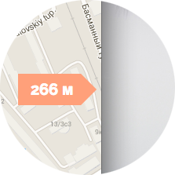

# Google maps direction arrows

Google maps plugin, wich enables direction arrows. Arrows stick to screen edge and point to target point when it's not in view port and they will show distance to viewport from border of screen. Check out [demo](#demo).

Sample usage:

    var map = new google.maps.Map(document.getElementById("map-canvas")),
        position = new google.maps.LatLng(55.730196, 37.602141),
        marker = new google.maps.Marker({ position: position }),
        distanceOverlay = new DistanceOverlay({ position: position });

    distanceOverlay.setMap(map);
    marker.setMap(map);

# Contributors

Thanks to [Dmitry Fofanov](https://github.com/twa) for collaboration on this one.
